# Autonomous Discovery Framework (ADF)

This project is an autonomous, multi-agent AI system built on a serverless cloud platform. It automates the entire pipeline of market intelligence gathering, from discovering new web sources to validating their contents for specific business criteria.

---

## Architecture Diagram

The system operates as a coordinated trio of serverless workers. The **Orchestrator** acts as the central "brain," deploying the **Explorer** and **Verifier** to perform tasks and storing all learned intelligence in a central database.

```mermaid
graph TD
    subgraph "System Core"
        direction LR
        ORCH["🤖 job-bot-orchestrator-worker <br/>(The Brain)"];
        EXP["🔎 job-bot-explorer-worker"];
        VER["✅ job-bot-verifier-worker"];
    end

    subgraph "Data & External Services"
        direction LR
        KV["🗄️ BOT_MEMORY (Cloudflare KV)"];
        API[("🌐 External APIs <br/> Gemini & SerpApi")];
    end

    CRON["⏰ Cron Trigger (Scheduler)"] -->|"1: Wakes Up"| ORCH;
    
    ORCH <-->|"Reads & Writes"| KV;
    
    ORCH -->|"2: Dispatches Task"| EXP;
    EXP -->|"Analyzes using"| API;
    EXP -->|"3: Returns Leads"| ORCH;
    
    ORCH -->|"4: Dispatches Lead"| VER;
    VER -->|"Verifies using"| API;
    VER -->|"5: Returns Verified URL"| ORCH;
    
    style ORCH fill:#28a745,stroke:#fff,color:#fff
    style EXP fill:#007bff,stroke:#fff,color:#fff
    style VER fill:#dc3545,stroke:#fff,color:#fff
    style KV fill:#ffc107,stroke:#333,color:#333
    style API fill:#6c757d,stroke:#fff,color:#fff
    style CRON fill:#17a2b8,stroke:#fff,color:#fff
```



---

## Getting Started: A Step-by-Step Setup Guide

This guide will walk you through deploying the entire framework to your own Cloudflare account.

### Prerequisites

1. **A Cloudflare Account:** You'll need a free or paid account.
2. **Node.js and npm:** Required to run the Cloudflare command-line tool.
3. **API Keys:** You will need keys for Google Gemini and SerpApi. The system requires both to function.
   - **Google Gemini:** For all AI-powered analysis. [Get a key here](https://aistudio.google.com/app/apikey).
   - **SerpApi:** For programmatic Google searches. [Get a key here](https://serpapi.com/dashboard).

---

### Step 1: Clone the Repository

First, get the project code onto your local machine.

```bash
git clone https://github.com/[YOUR_GITHUB_USERNAME]/Autonomous-Discovery-Framework.git
cd Autonomous-Discovery-Framework
```

### Step 2: Install and Login to Wrangler

Wrangler is the command-line tool for managing Cloudflare Workers.

```bash
# Install Wrangler
npm install -g wrangler

# Log in to your Cloudflare account
wrangler login
```

### Step 3: Create the KV Namespace

The system needs a database to store its memory. We use Cloudflare's KV for this.

Run the following command in your terminal:

```bash
npx wrangler kv:namespace create "BOT_MEMORY"
```

This command will output something like this. **Copy the `id` value**—you will need it in the next step.

```
🌀 Creating KV namespace "BOT_MEMORY"
✨ Success!
Add the following to your wrangler.toml:
kv_namespaces = [
  { binding = "BOT_MEMORY", id = "xxxxxxxxxxxxxxxxxxxxxxxxxxxxxxxx" }
]
```

### Step 4: Create the `wrangler.toml` Configuration File

This file tells Wrangler how to deploy your three workers. Create a new file named `wrangler.toml` in your project folder and paste the following code into it.

**Important:** Replace `"[PASTE YOUR KV ID HERE]"` with the `id` you copied in the previous step.

```toml
# Main configuration file for the Autonomous Discovery Framework

# The Orchestrator Worker - The Brains of the Operation
[[workers]]
name = "job-bot-orchestrator-worker"
main = "job-bot-orchestrator-worker" # Assumes your file is named this
compatibility_date = "2024-05-01"
kv_namespaces = [
  { binding = "BOT_MEMORY", id = "[PASTE YOUR KV ID HERE]" }
]

# The Explorer Worker - Scans for Leads
[[workers]]
name = "job-bot-explorer-worker"
main = "job-bot-explorer-worker"
compatibility_date = "2024-05-01"

# The Verifier Worker - Validates Leads
[[workers]]
name = "job-bot-verifier-worker"
main = "job-bot-verifier-worker"
compatibility_date = "2024-05-01"
```

### Step 5: Securely Set Your API Keys

We will add your API keys as encrypted secrets so they are never exposed in your code. You will also create a secret password to protect your internal triggers.

Run these commands one by one in your terminal, pasting your actual keys where indicated.

```bash
# Set your Gemini API key(s). You can add multiple separated by commas.
npx wrangler secret put GEMINI_API_KEYS

# Set your SerpApi key(s).
npx wrangler secret put SERPAPI_KEYS

# Create a secret password for internal worker communication.
# You can use a password generator or just type a random, complex string.
npx wrangler secret put INTERNAL_TRIGGER_SECRET
```

*These secrets will be automatically available to **all** workers deployed from this `wrangler.toml`.*

---

## Running the System

### 1. Deploy the Workers

Now that everything is configured, deploy the entire system with one command:

```bash
npx wrangler deploy
```

This will upload and deploy all three of your workers to Cloudflare.

### 2. Schedule the Orchestrator

The orchestrator needs to be "woken up" on a schedule to start its work.

1. Go to your Cloudflare Dashboard.
2. Navigate to **Workers & Pages**.
3. Click on `job-bot-orchestrator-worker`.
4. Click the **Triggers** tab.
5. Under the **Schedules** section, click **Add Cron Trigger**.
6. Set a schedule (e.g., `*/30 * * * *` to run every 30 minutes).
7. Click **Add trigger**.

### 3. Monitor the System

To see your framework in action, you can view the live logs from the main orchestrator:

```bash
npx wrangler tail job-bot-orchestrator-worker
```

**That's it!** Your Autonomous Discovery Framework is now live and will begin discovering, exploring, and verifying intelligence according to your schedule.

---

## Tech Stack

- **Compute:** Cloudflare Workers
- **Storage:** Cloudflare KV
- **AI / Machine Learning:** Google Gemini API
- **External Data:** SerpApi

---


